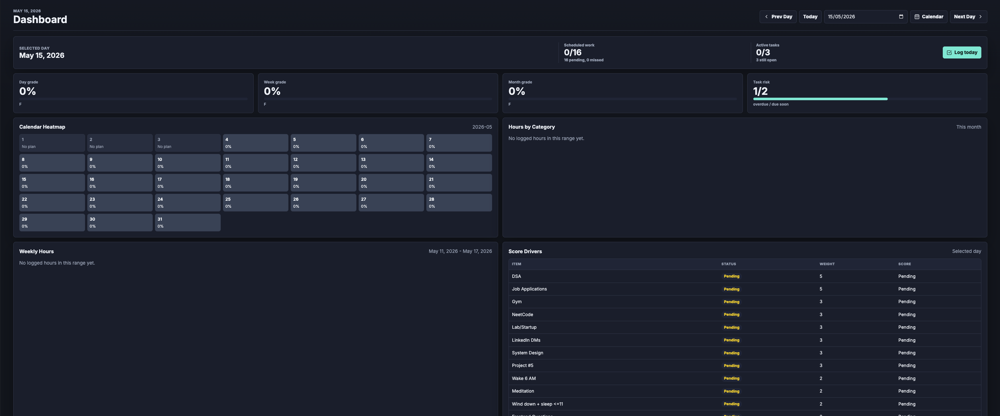

# Habit Command Center




Habit Command Center is a private planning and execution dashboard for turning weekly goals into daily action. It combines habit scheduling, task tracking, weighted scoring, extra work logging, and progress analytics in one focused Next.js app.

The product is built for a personal operating system workflow: plan the week, execute today, review the signal, and adjust the system without losing historical context.

## Product Flow

1. Plan the week in the Planner.
   Schedule recurring habits and deadline-based tasks across a seven-day grid.

2. Execute from Today.
   Log scheduled work, mark items complete or missed, add actual counts or hours, and capture extra unscheduled work.

3. Review progress on the Dashboard.
   See the selected day's completion signal, daily/weekly/monthly grades, task risk, heatmap performance, and time by category.

4. Manage commitments in Tasks.
   Create tasks with start dates, deadlines, priorities, status, and optional habit/category links.

5. Tune the system in Settings.
   Create and edit trackable items, customize targets and units, set priority weights, deactivate old items, and export private data.

## Core Features

- Private Supabase Auth protected workspace.
- Weighted scoring by priority: Low, Normal, High, and Critical.
- Daily, weekly, and monthly grade summaries.
- Dashboard completion signal for scheduled work and active tasks.
- Calendar heatmap with discrete score states.
- Today view for fast logging of scheduled work.
- Extra work logging with capped bonus credit.
- Weekly planner with optimistic schedule toggles.
- Editable trackable items with custom target and unit fields.
- Task manager with start date, deadline, priority, and status.
- Weekly notes for freeform planning context.
- Monthly hours by category and weekly hours charts.
- JSON export for personal backup.
- Stable dark-first theme with light mode support.

## Scoring Model

Only scheduled work affects the base score. Each scheduled item contributes according to its priority weight.

```text
planned_score = sum(item_score * item_weight) / sum(item_weight)
```

Unscheduled extra work is tracked separately and can add up to 5 bonus percentage points.

Pending planned items behave differently by date:

- Past dates: blank scheduled items are treated as missed.
- Today and future dates: blank scheduled items remain pending.

## Tech Stack

- Next.js App Router
- React
- TypeScript
- Supabase Auth and Postgres
- Supabase SSR helpers
- Recharts
- Lucide React
- Vercel-ready deployment

## Project Structure

```text
app/                  Next.js routes and global styles
components/           Main application UI
lib/                  Date, scoring, seed, Supabase, and type utilities
supabase/migrations/  Database schema and RLS policies
```

The original static prototype files are kept for reference, but the production app is the Next.js + Supabase implementation.

## Local Development

Install dependencies:

```bash
npm install
```

Create `.env.local` from `.env.example` and fill in the required values:

```bash
NEXT_PUBLIC_SUPABASE_URL=your-supabase-project-url
NEXT_PUBLIC_SUPABASE_PUBLISHABLE_KEY=your-publishable-key
# Or use NEXT_PUBLIC_SUPABASE_ANON_KEY if your project only has a legacy anon key.
APP_ALLOWED_EMAILS=your_email@example.com
```

Run the development server:

```bash
npm run dev
```

Open `http://localhost:3000`.

## Quality Checks

```bash
npm run lint
npm run typecheck
npm run build
```

## Database Setup

Run the migration in Supabase SQL Editor or through the Supabase CLI:

```text
supabase/migrations/202605150001_initial_schema.sql
```

The migration creates the private habit, task, plan, log, category, and weekly note tables with row-level security policies.

## Google Sign-In

Google sign-in uses Supabase Auth's Google provider. Do not enable Supabase OAuth Server for this use case unless Habit Command Center needs to act as an identity provider for other third-party applications.

In Supabase:

1. Go to Auth > Providers > Google.
2. Enable Google.
3. Add the Google OAuth client ID and client secret from Google Cloud.
4. In Auth > URL Configuration, set Site URL to your deployed app URL.
5. Add redirect URLs for production and local development:

```text
https://your-vercel-domain.vercel.app/auth/callback
http://localhost:3000/auth/callback
```

In Google Cloud:

1. Create an OAuth Client ID with application type Web application.
2. Add your app URL under Authorized JavaScript origins.
3. Add the Supabase callback URL under Authorized redirect URIs:

```text
https://your-supabase-project-ref.supabase.co/auth/v1/callback
```

Use the exact callback URL shown in the Supabase Google provider screen.

## Deploy to Vercel

1. Push the project to GitHub.
2. Import the repository in Vercel as a Next.js project.
3. Add these environment variables in Vercel Project Settings:

```bash
NEXT_PUBLIC_SUPABASE_URL=your-supabase-project-url
NEXT_PUBLIC_SUPABASE_PUBLISHABLE_KEY=your-publishable-key
# Or use NEXT_PUBLIC_SUPABASE_ANON_KEY if your project only has a legacy anon key.
APP_ALLOWED_EMAILS=your_email@example.com
```

4. Run the Supabase migration against the production Supabase project.
5. Deploy. Vercel should detect Next.js and run `npm run build` automatically.

## Privacy And Safety

This app is designed for private personal data. Do not commit real environment files, database exports, spreadsheets, keys, or generated backups.

Use `.env.example` as the public template and store production secrets only in Vercel and Supabase.
